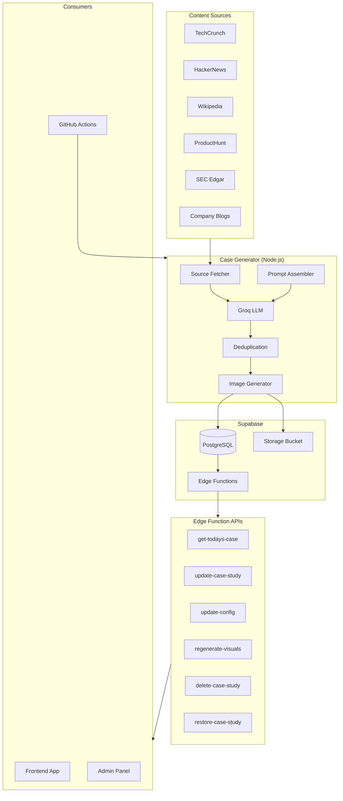
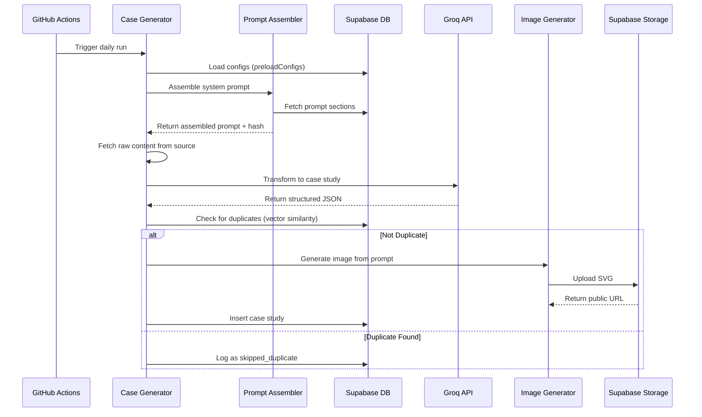
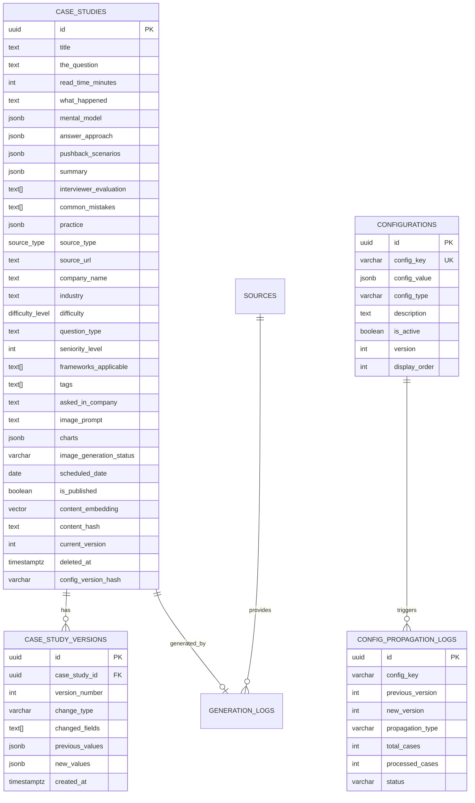
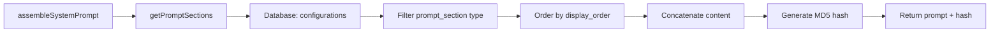
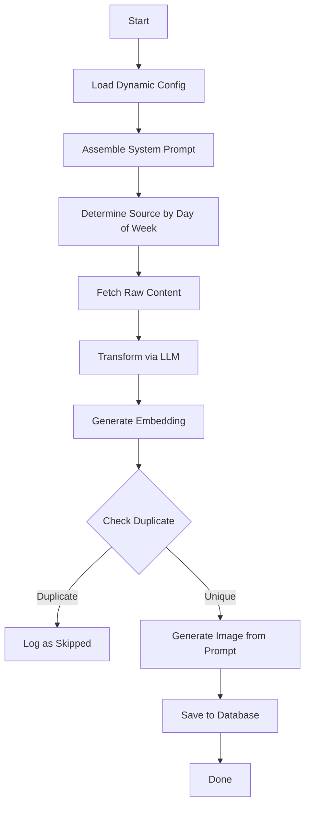
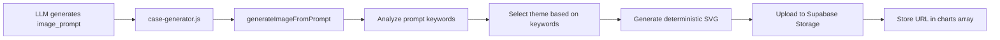
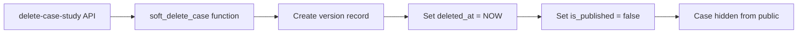
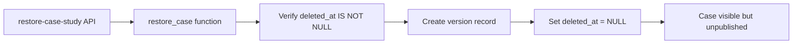

# Product Minds Case Study Engine - Design Document

> **Version**: 2.0 (Config-Driven Architecture)
> **Last Updated**: January 2026
> **Audience**: Developers maintaining this codebase

---

## Table of Contents

1. [System Overview](#1-system-overview)
2. [Architecture](#2-architecture)
3. [Database Schema](#3-database-schema)
4. [Configuration System](#4-configuration-system)
5. [Case Generation Flow](#5-case-generation-flow)
6. [Edge Functions (API Reference)](#6-edge-functions-api-reference)
7. [Scripts Reference](#7-scripts-reference)
8. [Image Generation](#8-image-generation)
9. [Versioning & Soft Delete](#9-versioning--soft-delete)
10. [Deployment & Migrations](#10-deployment--migrations)
11. [Error Handling](#11-error-handling)
12. [API Examples](#12-api-examples)

---

## 1. System Overview

The Product Minds Case Study Engine is a **config-driven content generation system** that creates PM interview case studies. It automatically:

1. **Scrapes content** from various sources (TechCrunch, Wikipedia, HackerNews, etc.)
2. **Transforms** raw content into structured interview case studies using LLM (Groq/Llama)
3. **Deduplicates** using vector embeddings
4. **Generates visuals** from text prompts
5. **Schedules & publishes** one case study per day
6. **Serves** case studies via Edge Functions

### Key Design Principles

| Principle | Implementation |
|-----------|----------------|
| **Config-Driven** | All prompts, thresholds, and system settings stored in database |
| **Versioned** | Every case study change creates a version record |
| **Soft Delete** | Cases are never hard-deleted, always recoverable |
| **Bulk Operations** | APIs support single and bulk operations |
| **Propagation** | Config changes can propagate to all existing cases |

---

## 2. Architecture

### High-Level Architecture



### Data Flow



---

## 3. Database Schema

### Entity Relationship Diagram



### Core Tables

| Table | Purpose |
|-------|---------|
| `case_studies` | Main content table with all case study data |
| `configurations` | All system configs, prompts, thresholds |
| `case_study_versions` | Audit trail for all case changes (max 5 per case) |
| `config_propagation_logs` | Tracks config change propagation |
| `valid_config_keys` | Reference table for valid config keys |
| `sources` | Content source configuration |
| `generation_logs` | Audit trail for generation attempts |
| `daily_schedule` | Schedule tracking |

### Key Columns in `case_studies`

| Column | Type | Purpose |
|--------|------|---------|
| `image_prompt` | TEXT | LLM-generated prompt for image creation |
| `image_generation_status` | VARCHAR | `pending`, `generating`, `completed`, `failed` |
| `config_version_hash` | VARCHAR | MD5 hash of prompt config used to generate |
| `content_embedding` | VECTOR(1536) | For deduplication via similarity search |
| `deleted_at` | TIMESTAMPTZ | Soft delete timestamp (NULL = active) |
| `current_version` | INTEGER | Current version number |

---

## 4. Configuration System

### Config Types

| Type | Purpose | Example Keys |
|------|---------|--------------|
| `prompt_section` | LLM prompt sections | `prompt_system_intro`, `prompt_output_schema` |
| `system` | System behavior configs | `groq_model`, `max_generation_per_run` |
| `threshold` | Numeric thresholds | `similarity_threshold`, `company_cooldown_days` |

### Prompt Sections (Display Order)

| Order | Config Key | Purpose |
|-------|------------|---------|
| 10 | `prompt_system_intro` | System role definition |
| 20 | `prompt_output_schema` | JSON output structure |
| 30 | `prompt_question_types` | Available question types |
| 40 | `prompt_mental_models` | Mental model patterns per type |
| 50 | `prompt_answer_structure` | Seniority/difficulty definitions |
| 60 | `prompt_evaluation_criteria` | Company interview matching |
| 70 | `prompt_image_generation` | Image prompt instructions |
| 80 | `prompt_source_customization` | Writing style constraints |

### System Configs

| Config Key | Default | Purpose |
|------------|---------|---------|
| `similarity_threshold` | 0.85 | Vector similarity threshold for duplicate detection |
| `company_cooldown_days` | 60 | Days before same company can reappear |
| `buffer_target_days` | 14 | Target days of scheduled content |
| `max_generation_per_run` | 3 | Max cases to generate per workflow |
| `groq_model` | `llama-3.3-70b-versatile` | LLM model to use |
| `groq_max_tokens` | 4000 | Max tokens per generation |
| `chart_color_palettes` | Object | Color palettes for charts |
| `version_retention_count` | 5 | Max versions to keep per case |

### Config Loader (`scripts/config/config-loader.js`)

```javascript
// Get single config with caching (5 min TTL)
const threshold = await getConfig('similarity_threshold');

// Get all prompt sections (ordered by display_order)
const sections = await getPromptSections();

// Preload all configs at startup
await preloadConfigs();

// Bypass cache for fresh data
const fresh = await getConfig('groq_model', { bypassCache: true });
```

### Prompt Assembly Flow



---

## 5. Case Generation Flow

### Daily Generation (`scripts/case-generator.js`)



### Source Rotation

| Day | Source Type | Source |
|-----|-------------|--------|
| Sunday (0) | `framework_classic` | Classic PM Cases |
| Monday (1) | `historical_wikipedia` | Wikipedia Historical |
| Tuesday (2) | `historical_archive` | Archive.org |
| Wednesday (3) | `live_news_techcrunch` | TechCrunch |
| Thursday (4) | `live_news_hackernews` | HackerNews |
| Friday (5) | `company_blog` | Company Blogs |
| Saturday (6) | `company_sec_filing` | SEC Filings |

### Case Study JSON Structure

```json
{
  "title": "Root Cause Analysis: Netflix's Password Sharing Decision",
  "the_question": "You're a PM at a streaming service...",
  "read_time_minutes": 3,
  "what_happened": "Netflix discovered that...",
  "mental_model": {
    "flow": "Clarify → Scope → Decompose → Diagnose → Theorize → Validate → Solve",
    "intro": "Before diving in, here's how to think about Root Cause Analysis problems:",
    "steps": ["Clarify the problem...", "Scope the investigation..."],
    "disclaimer": "This isn't a rigid script..."
  },
  "answer_approach": [
    {
      "part_number": 1,
      "title": "Clarify the Problem",
      "time_estimate": "1 min",
      "what_you_say": "Before I dive in...",
      "questions_to_ask": ["What's the current conversion rate?"],
      "thinking": "Cart abandonment → could be UX..."
    }
  ],
  "pushback_scenarios": [
    {
      "if_they_say": "But we'll lose email captures!",
      "you_say": "Let's look at what those captures are worth..."
    }
  ],
  "summary": {
    "approach": ["Clarify", "Scope", "Decompose"],
    "key_insight": "Forced registration optimizes for..."
  },
  "interviewer_evaluation": ["Structured approach...", "Data-driven diagnosis..."],
  "common_mistakes": ["Jumping to solutions...", "Ignoring stakeholder concerns..."],
  "practice": {
    "question": "A SaaS product has 30% drop-off...",
    "guidance": "Apply the same flow..."
  },
  "difficulty": "intermediate",
  "question_type": "Root Cause Analysis (RCA)",
  "seniority_level": 1,
  "frameworks_applicable": ["Funnel Analysis", "A/B Testing"],
  "industry": "Streaming",
  "tags": ["conversion", "growth", "retention"],
  "company_name": "Netflix",
  "asked_in_company": "Amazon",
  "image_prompt": "A minimalist illustration showing password sharing..."
}
```

---

## 6. Edge Functions (API Reference)

### Overview

| Function | Method | Purpose |
|----------|--------|---------|
| `get-todays-case` | GET | Fetch today's published case |
| `get-config` | GET | Fetch configuration values |
| `update-config` | PATCH | Update configs with propagation |
| `update-case-study` | PATCH | Update case studies (single/bulk) |
| `regenerate-visuals` | POST | Regenerate images (single/bulk) |
| `delete-case-study` | DELETE | Soft delete a case |
| `restore-case-study` | POST | Restore a soft-deleted case |

---

### `get-todays-case`

**Purpose**: Returns today's published case study for the frontend.

**Endpoint**: `GET /get-todays-case`

**Response**:
```json
{
  "success": true,
  "data": { /* full case study object */ }
}
```

**Fallback**: If no case scheduled for today, returns a hardcoded fallback case (Best Buy's $300M Button).

```json
{
  "success": false,
  "error": "No case study available for today",
  "fallback": true,
  "data": { /* fallback case */ }
}
```

---

### `get-config`

**Purpose**: Fetch configuration values from database.

**Endpoint**: `GET /get-config`

**Query Parameters**:
| Param | Type | Required | Description |
|-------|------|----------|-------------|
| `key` | string | No | Specific config key |
| `type` | string | No | Config type filter |
| `assembledPrompt` | boolean | No | Return assembled prompt |

**Examples**:
```bash
# Get all configs
GET /get-config

# Get specific config
GET /get-config?key=similarity_threshold

# Get by type
GET /get-config?type=prompt_section

# Get assembled prompt
GET /get-config?assembledPrompt=true
```

---

### `update-config`

**Purpose**: Update configuration values with optional propagation to all cases.

**Endpoint**: `PATCH /update-config`

**Payload (Single Config)**:
```json
{
  "configKey": "prompt_image_generation",
  "configValue": {
    "content": "## IMAGE GENERATION\n\nYour updated prompt..."
  },
  "description": "Updated image instructions",
  "updatedBy": "admin",
  "propagate": true,
  "propagateOptions": {
    "regenerateImages": false,
    "updateMetadataOnly": false
  }
}
```

**Payload (Multiple Configs)**:
```json
{
  "configs": [
    {
      "configKey": "similarity_threshold",
      "configValue": { "value": 0.90 }
    },
    {
      "configKey": "company_cooldown_days",
      "configValue": { "value": 30 }
    }
  ],
  "propagate": true
}
```

**Propagation Behavior**:

| `propagate` | `updateMetadataOnly` | Effect |
|-------------|---------------------|--------|
| `false` | - | Only updates config, no effect on cases |
| `true` | `false` | Updates `config_version_hash` AND sets `image_generation_status = 'pending'` |
| `true` | `true` | Only updates `config_version_hash` |

**Response**:
```json
{
  "success": true,
  "message": "Successfully updated 2 config(s)",
  "updated": [
    { "key": "similarity_threshold", "previousVersion": 1, "newVersion": 2 }
  ],
  "propagation": {
    "logId": "uuid",
    "status": "completed",
    "totalCases": 150,
    "processed": 150,
    "failed": 0
  }
}
```

**Valid Config Keys**:
- Prompt: `prompt_system_intro`, `prompt_output_schema`, `prompt_question_types`, `prompt_mental_models`, `prompt_answer_structure`, `prompt_evaluation_criteria`, `prompt_image_generation`, `prompt_source_customization`
- System: `similarity_threshold`, `company_cooldown_days`, `buffer_target_days`, `max_generation_per_run`, `groq_model`, `groq_max_tokens`, `chart_color_palettes`, `version_retention_count`

---

### `update-case-study`

**Purpose**: Update case studies with validation and versioning.

**Endpoint**: `PATCH /update-case-study`

**Payload (Single)**:
```json
{
  "caseId": "uuid",
  "updates": {
    "title": "Updated Title",
    "difficulty": "advanced",
    "tags": ["new", "tags"]
  },
  "changeReason": "Fixed typo in title",
  "updatedBy": "admin"
}
```

**Payload (Bulk)**:
```json
{
  "bulk": true,
  "caseIds": ["uuid1", "uuid2", "uuid3"],
  "updates": {
    "difficulty": "intermediate"
  },
  "changeReason": "Bulk difficulty update"
}
```

**Validated Enums**:
| Field | Valid Values |
|-------|--------------|
| `difficulty` | `beginner`, `intermediate`, `advanced` |
| `question_type` | `Root Cause Analysis (RCA)`, `Product Design (Open-ended)`, `Metrics & Measurement`, `Feature Prioritization`, `Strategy & Vision`, `Pricing Strategy`, `Launch Decision`, `Growth Strategy`, `Trade-off Analysis`, `A/B Test Design`, `Estimation`, `Execution` |
| `seniority_level` | `0`, `1`, `2`, `3` |

**Response (Bulk)**:
```json
{
  "success": true,
  "message": "Updated 3, failed 0",
  "results": [
    { "caseId": "uuid1", "success": true, "newVersion": 2 },
    { "caseId": "uuid2", "success": true, "newVersion": 3 }
  ]
}
```

---

### `regenerate-visuals`

**Purpose**: Regenerate images for case studies.

**Endpoint**: `POST /regenerate-visuals`

**Payload (Single)**:
```json
{
  "caseId": "uuid",
  "imagePrompt": "A minimalist illustration showing growth metrics..."
}
```

**Payload (Bulk)**:
```json
{
  "bulk": true,
  "filter": {
    "hasNoImage": true,
    "questionType": "Root Cause Analysis (RCA)"
  }
}
```

**Response**:
```json
{
  "success": true,
  "message": "Regenerated visuals for 1 case(s)",
  "results": [
    {
      "caseId": "uuid",
      "success": true,
      "chartsGenerated": 1,
      "imageUrl": "https://..."
    }
  ]
}
```

---

### `delete-case-study`

**Purpose**: Soft delete a case study.

**Endpoint**: `DELETE /delete-case-study`

**Payload**:
```json
{
  "caseId": "uuid",
  "reason": "Outdated content",
  "deletedBy": "admin"
}
```

**Effect**:
- Sets `deleted_at = NOW()`
- Sets `is_published = false`
- Creates version record with `change_type = 'soft_delete'`

---

### `restore-case-study`

**Purpose**: Restore a soft-deleted case study.

**Endpoint**: `POST /restore-case-study`

**Payload**:
```json
{
  "caseId": "uuid",
  "restoredBy": "admin"
}
```

**Effect**:
- Sets `deleted_at = NULL`
- Creates version record with `change_type = 'restore'`
- Does NOT automatically republish (manual step)

---

## 7. Scripts Reference

### Core Scripts

| Script | Purpose | Usage |
|--------|---------|-------|
| `case-generator.js` | Main generation orchestrator | `node scripts/case-generator.js [--dry-run] [--count=N]` |
| `run-generator.js` | Runner with error handling | `node scripts/run-generator.js` |
| `schedule-cases.js` | Schedule unscheduled cases | `node scripts/schedule-cases.js` |
| `check-buffer.js` | Check content buffer status | `node scripts/check-buffer.js` |
| `report-status.js` | Generate status report | `node scripts/report-status.js` |

### Utility Scripts

| Script | Purpose |
|--------|---------|
| `prompts/prompt-assembler.js` | Assembles prompt from DB sections |
| `config/config-loader.js` | Loads configs with caching |
| `config/config-updater.js` | Updates configs programmatically |
| `utils/chart-generator.js` | Generates charts/images |
| `utils/deduplication.js` | Vector similarity checks |
| `utils/groq-client.js` | Groq API wrapper |
| `utils/supabase-client.js` | Supabase client instance |

### Source Fetchers

| Script | Source |
|--------|--------|
| `sources/techcrunch.js` | TechCrunch RSS |
| `sources/hackernews.js` | HackerNews API |
| `sources/wikipedia.js` | Wikipedia product launches |
| `sources/producthunt.js` | ProductHunt API |
| `sources/sec-edgar.js` | SEC filings |
| `sources/company-blogs.js` | Company newsrooms |
| `sources/archive-org.js` | Archive.org historical |
| `sources/framework-cases.js` | Classic PM frameworks |

---

## 8. Image Generation

### Flow



### Theme Selection

Keywords in `image_prompt` map to themes:

| Keywords | Theme | Primary Color |
|----------|-------|--------------|
| growth, increase, success, scale | Growth | `#10B981` (green) |
| disrupt, crisis, challenge, risk | Disruption | `#EF4444` (red) |
| innovat, creative, new, idea | Innovation | `#8B5CF6` (purple) |
| decision, choice, trade, path | Decision | `#F59E0B` (amber) |
| (default) | Strategy | `#4F46E5` (indigo) |

### Storage

- **Bucket**: `case-study-charts`
- **Path**: `{caseId}/image-{timestamp}.svg`
- **Format**: SVG (deterministic based on title + prompt hash)

### Regeneration Trigger

Images are marked for regeneration when:
1. `update-config` is called with `propagate: true` and `updateMetadataOnly: false`
2. Manual call to `regenerate-visuals` API

---

## 9. Versioning & Soft Delete

### Version Tracking

Every case study change creates a version record:

```sql
-- Version record structure
{
  case_study_id: "uuid",
  version_number: 2,
  change_type: "content",  -- content, metadata, visuals, soft_delete, restore
  changed_fields: ["title", "difficulty"],
  previous_values: { "title": "Old Title", "difficulty": "beginner" },
  new_values: { "title": "New Title", "difficulty": "intermediate" },
  created_at: "2026-01-06T...",
  created_by: "admin"
}
```

### Auto-Pruning

The system automatically keeps only the last 5 versions per case:

```sql
-- In create_case_version function
SELECT COUNT(*) INTO version_count FROM case_study_versions WHERE case_study_id = p_case_id;
IF version_count > 5 THEN
  DELETE FROM case_study_versions WHERE id IN (
    SELECT id FROM case_study_versions
    WHERE case_study_id = p_case_id ORDER BY version_number ASC LIMIT (version_count - 5)
  );
END IF;
```

### Soft Delete Flow



### Restore Flow



---

## 10. Deployment & Migrations

### Migration Files

| File | Purpose |
|------|---------|
| `001_initial_schema.sql` | Core tables: case_studies, sources, generation_logs |
| `002_add_question_type_and_seniority_level.sql` | Add question_type and seniority_level columns |
| `003_consolidated_schema.sql` | **Combined migration** for all new features |

### 003_consolidated_schema.sql Contents

This consolidated migration includes:

1. **Additional columns**: `asked_in_company`, `charts`
2. **New template schema**: `the_question`, `mental_model`, `answer_approach`, etc.
3. **Configurations table**: Stores all config key-value pairs
4. **Case study versions**: Audit trail with auto-pruning
5. **Soft delete columns**: `deleted_at`, `deleted_by`, `delete_reason`
6. **Image generation**: `image_prompt`, `image_generation_status`, `config_version_hash`
7. **Propagation logs**: Track config change propagation
8. **Helper functions**: `get_config`, `create_case_version`, `soft_delete_case`, etc.
9. **RLS policies**: Security rules for public/service role access
10. **Seed data**: Default prompt sections and system configs

### Running Migrations

**Fresh Deployment**:
```bash
# Run in order
psql -f supabase/migrations/001_initial_schema.sql
psql -f supabase/migrations/002_add_question_type_and_seniority_level.sql
psql -f supabase/migrations/003_consolidated_schema.sql
```

**Existing Database** (if 003-006 already applied):
- Do NOT run `003_consolidated_schema.sql`
- The consolidated file is for fresh deployments only

### Environment Variables

```bash
# Required
SUPABASE_URL=https://your-project.supabase.co
SUPABASE_SERVICE_KEY=your-service-role-key
SUPABASE_ANON_KEY=your-anon-key
GROQ_API_KEY=your-groq-api-key

# Optional
GROQ_MODEL=llama-3.3-70b-versatile
```

---

## 11. Error Handling

### Validation Errors

APIs return helpful error messages with valid options:

```json
{
  "success": false,
  "error": "Validation failed",
  "validationErrors": [
    "Invalid difficulty 'expert'. Valid values: beginner, intermediate, advanced"
  ],
  "validEnums": {
    "difficulty": ["beginner", "intermediate", "advanced"],
    "question_type": ["Root Cause Analysis (RCA)", "..."]
  }
}
```

### Prompt Assembly Errors

If database is unavailable:

```javascript
// prompt-assembler.js throws instead of using fallback
throw new Error('No prompt sections found in database. Please run migrations to seed configurations.');
```

### Generation Errors

All generation attempts are logged:

```sql
-- generation_logs table
status: 'failed'
error_message: "JSON parse failed: Unexpected token..."
```

### Propagation Errors

Propagation logs track failures:

```json
{
  "propagation": {
    "logId": "uuid",
    "status": "failed",
    "totalCases": 150,
    "processed": 0,
    "failed": 150
  }
}
```

---

## 12. API Examples

### Complete Workflow: Update Prompt and Regenerate Images

```bash
# 1. Update the image generation prompt
curl -X PATCH 'https://your-project.supabase.co/functions/v1/update-config' \
  -H 'Authorization: Bearer SERVICE_ROLE_KEY' \
  -H 'Content-Type: application/json' \
  -d '{
    "configKey": "prompt_image_generation",
    "configValue": {
      "content": "## IMAGE GENERATION\n\nGenerate a professional image_prompt..."
    },
    "propagate": true,
    "propagateOptions": {
      "regenerateImages": false
    }
  }'

# 2. Regenerate images for cases with pending status
curl -X POST 'https://your-project.supabase.co/functions/v1/regenerate-visuals' \
  -H 'Authorization: Bearer SERVICE_ROLE_KEY' \
  -H 'Content-Type: application/json' \
  -d '{
    "bulk": true,
    "filter": {
      "hasNoImage": true
    }
  }'
```

### Bulk Update Difficulty

```bash
curl -X PATCH 'https://your-project.supabase.co/functions/v1/update-case-study' \
  -H 'Authorization: Bearer SERVICE_ROLE_KEY' \
  -H 'Content-Type: application/json' \
  -d '{
    "bulk": true,
    "caseIds": ["uuid1", "uuid2", "uuid3"],
    "updates": {
      "difficulty": "advanced",
      "seniority_level": 2
    },
    "changeReason": "Recategorized as advanced content"
  }'
```

### Soft Delete and Restore

```bash
# Delete
curl -X DELETE 'https://your-project.supabase.co/functions/v1/delete-case-study' \
  -H 'Authorization: Bearer SERVICE_ROLE_KEY' \
  -H 'Content-Type: application/json' \
  -d '{
    "caseId": "uuid",
    "reason": "Content outdated"
  }'

# Restore
curl -X POST 'https://your-project.supabase.co/functions/v1/restore-case-study' \
  -H 'Authorization: Bearer SERVICE_ROLE_KEY' \
  -H 'Content-Type: application/json' \
  -d '{
    "caseId": "uuid"
  }'
```

### Get Assembled Prompt (for debugging)

```bash
curl 'https://your-project.supabase.co/functions/v1/get-config?assembledPrompt=true' \
  -H 'Authorization: Bearer ANON_KEY'
```

---

## Appendix: Database Functions Reference

| Function | Purpose | Returns |
|----------|---------|---------|
| `get_config(key)` | Get single config value | JSONB |
| `get_configs_by_type(type)` | Get all configs of type | TABLE |
| `get_assembled_prompt()` | Concatenate all prompt sections | TEXT |
| `get_prompt_version_hash()` | MD5 hash of assembled prompt | VARCHAR |
| `create_case_version(...)` | Create version with auto-prune | UUID |
| `soft_delete_case(id, reason, by)` | Soft delete case | BOOLEAN |
| `restore_case(id, by)` | Restore soft-deleted case | BOOLEAN |
| `update_config(key, value, by)` | Update config with version bump | BOOLEAN |
| `create_propagation_log(...)` | Create propagation log entry | UUID |
| `update_propagation_progress(...)` | Update propagation status | BOOLEAN |
| `find_similar_cases(embedding, threshold, company, days)` | Find duplicates | TABLE |
| `get_buffer_status()` | Check content buffer | TABLE |
| `schedule_next_case(date)` | Auto-schedule case for date | UUID |

---

*Document generated January 2026*